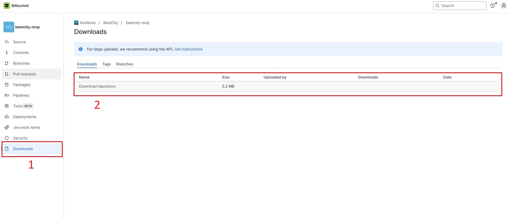
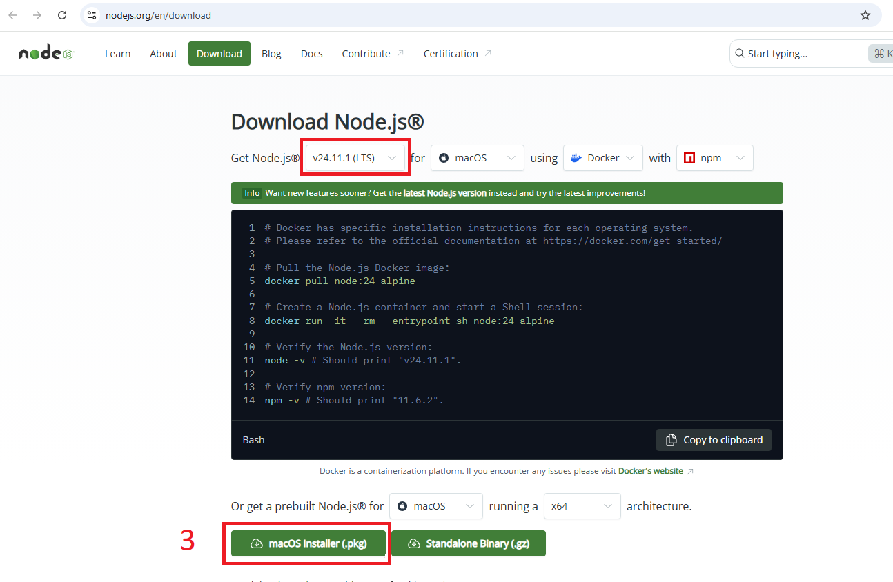

# Tirios

## What is Tirios?

**Tirios** is a modern real estate investment platform that combines traditional property investing with cryptocurrency payments. Built with React and Tailwind CSS, it mirrors the functionality of Arrived.com while adding blockchain-based transaction capabilities.

## Key Features

- Cryptocurrency-enabled property transactions
- Mobile-responsive design
- SEO-optimized architecture
- Real-time market data integration
- Interactive 3D property visualization
- Smart contract integration for secure transactions

## Technical Overview

The platform is built using:

- React for component-based architecture
- Tailwind CSS for responsive styling
- React Router for client-side routing
- Three.js for 3D property visualizations
- Web3.js for blockchain interactions

## How to Run the Project

### 1. Download the Project locally.

Please download the project as a ZIP file.

- Open the repository on Bitbucket
- Click the Download button on the left menu
- Select Download repository
- A ZIP file will be downloaded
- Extract (unzip) it on your computer
- Open the downloaded Project.

### 2. Installing the NodeJS

- Install NodeJS ( version 20, 22 or 24 ) : https://nodejs.org/en/download

### 3. Run the Project using a Terminal

- Open a Terminal and locate the downloaded project file.
- Install the node module : Enter the **npm install** in the Terminal
- Build the Project : Enter the **npm start** in the Terminal

## Learn More

- You can learn more in the [Create React App documentation](https://facebook.github.io/create-react-app/docs/getting-started).
- To learn React, check out the [React documentation](https://reactjs.org/).

## Core Components

### 1. **Home Page** - Hero Section with value proposition

- Featured Properties Grid (3 properties)
- "Why Choose Us" highlighting crypto benefits
- Investment Guide with step-by-step process
- Blog Preview with latest 3 posts
- Discord Community Section

### 2. **Properties Page**

- Filterable property grid
- Advanced search functionality
- Detailed property cards
- Three.js 3D visualization

### 3. **About Us Page**

- Company vision and mission
- Team profiles
- Platform statistics

### 4. **Blog Section**

- Category filtering
- Search functionality
- Author profiles
- Social sharing buttons

## Development Guidelines

### 1. **Component Creation**

- Follow atomic design principles
- Use TypeScript for type safety
- Implement responsive designs using Tailwind breakpoints
- Add proper comments and documentation

### 2. **State Management**

- Use React Context for global state
- Implement Redux for complex state management
- Keep component state minimal

### 3. **Security Considerations**

- Implement proper input validation
- Secure wallet connections
- Follow best practices for crypto transactions
- Regular security audits

## Contributing

Contributions are welcome! Please:

- Create a feature branch
- Write comprehensive tests
- Document new features
- Ensure code style consistency
- Submit pull requests with clear descriptions

## Acknowledgments

Special thanks to the Tirios team for inspiration and the React/Tailwind CSS communities for their continued support and resources.
